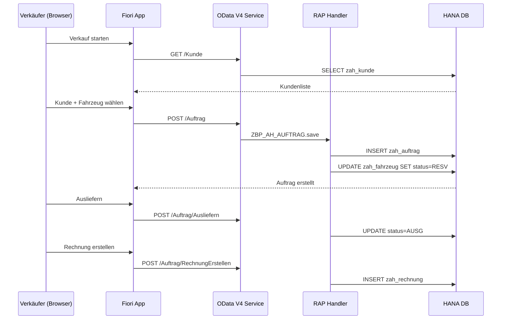

# Architektur – Autohaus HESSEN (Modern Stack)

## Technologie-Stack

| Schicht | Technologie | Version |
|---|---|---|
| Frontend | SAPUI5 / Fiori | 1.108+ |
| API | OData V4 | RAP Service |
| Backend | ABAP RAP | S/4HANA 2021+ |
| Datenbank | SAP HANA | Cloud / On-Prem |
| Auth | SAP IDM / IAS | SSO-fähig |
| Hosting | S/4HANA oder BTP ABAP Env | - |

## Warum S/4HANA + RAP + Fiori?

1. **Jeder Rechner**: Browser reicht, kein SAP GUI Install
2. **Modernster SAP-Standard**: RAP ist der aktuelle Entwicklungsstandard
3. **Mobile-fähig**: Responsive Design auf Tablet/Handy
4. **Skalierbar**: Von 5 bis 500 Benutzer
5. **Zukunftssicher**: SAP investiert in RAP + Fiori, nicht in klassisches ABAP

## Komponenten-Übersicht

```
fiori/
├── zahdashboard/     → Startseite mit KPIs
├── zahfahrzeug/      → Fahrzeugverwaltung (Liste + Detail)
├── zahkunde/         → Kundenverwaltung (Liste + Anlegen)
├── zahverkauf/       → Verkaufsprozess (Wizard)
└── launchpad/        → Launchpad-Konfiguration + Rollen

rap/
├── cds/              → 16 CDS Views (Interface + Consumption)
├── behavior/         → 4 Behavior Definitions
├── handlers/         → 4 Handler-Klassen
└── service/          → OData V4 Service Definition

abap/
├── tables/           → 18 Datenbanktabellen
├── classes/          → 7 ABAP-Klassen (Geschäftslogik)
└── programs/         → Reports + Demo-Daten
```

## Datenfluss: Verkaufsprozess



## S/4HANA vs. BTP – Entscheidungshilfe

| Kriterium | S/4HANA On-Prem | BTP ABAP Environment |
|---|---|---|
| Kosten | Hoch (Lizenz) | Pay-per-Use |
| Kontrolle | Voll | Cloud-managed |
| Integration FI/CO | Nativ | Custom |
| Setup-Zeit | 2–3 Tage | 1–2 Tage |
| Wartung | Eigene IT | SAP-managed |
| **Empfehlung** | **Für echtes Autohaus** | Für Pilot/Cloud-first |

**Für Autohaus HESSEN empfehle ich S/4HANA On-Premise** (oder S/4HANA Cloud Private Edition), weil:
- Volle Kontrolle über Daten
- Keine monatlichen Cloud-Kosten
- Integration mit SAP FI möglich (Buchhaltung)
- IT-Infrastruktur wahrscheinlich vorhanden
