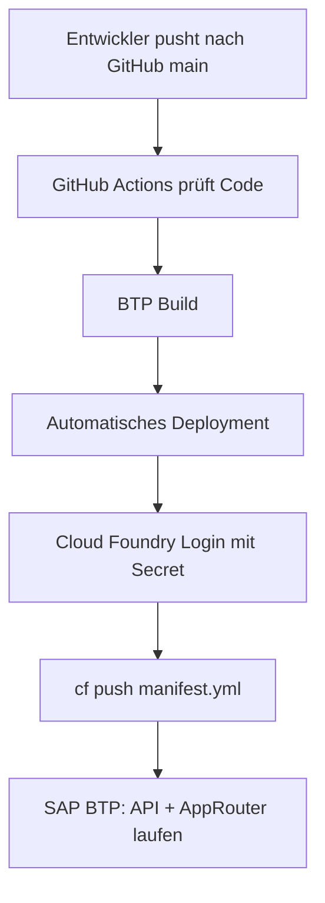

# CI/CD Deployment nach SAP BTP

Diese Pipeline ermöglicht Deployment aus GitHub heraus, ohne jedes Mal einen manuellen SAP-SSO-Code in Codex einzugeben.

## Was die Pipeline macht

- Bei jedem Push nach `main` prüft GitHub Actions den Code und deployed automatisch nach SAP BTP.
- Manuelles Deployment ist zusätzlich über **Actions > SAP BTP CI/CD > Run workflow** möglich.
- Vor dem Deployment werden Checks und BTP-Build ausgeführt.
- Danach werden API und AppRouter mit `manifest.yml` nach SAP BTP Cloud Foundry gepusht.

## Benötigte GitHub-Secrets

In GitHub:

`Repository > Settings > Secrets and variables > Actions > New repository secret`

Pflicht:

```text
CF_API=https://api.cf.us10-001.hana.ondemand.com
CF_ORG=b4bd422ftrial
CF_SPACE=dev
```

Empfohlen für professionelles Deployment:

```text
CF_CLIENT_ID=<technischer Cloud-Foundry-Client>
CF_CLIENT_SECRET=<Secret des technischen Clients>
```

Fallback, wenn noch kein technischer Client existiert:

```text
CF_USERNAME=<BTP Benutzer>
CF_PASSWORD=<BTP Passwort>
```

Optional, falls der Benutzer über einen bestimmten Identity Provider läuft:

```text
CF_ORIGIN=<Origin Key des Identity Providers>
```

Wichtig: `CF_PASSWORD` ist **nicht** der kurze SAP-SSO-Code. Der SSO-Code läuft nach wenigen Minuten ab und ist für Automatisierung absichtlich nicht geeignet. `CF_PASSWORD` muss ein dauerhaftes Passwort eines Benutzers oder technischen Benutzers sein.

Der Fallback ist weniger professionell, weil er an einen echten Benutzer gebunden ist. Für ein Unternehmen ist ein technischer Zugang besser.

## Warum der SSO-Code nicht automatisch geht

Der SAP-SSO-Passcode ist ein Einmalcode. Er ist nur für eine kurze manuelle Anmeldung gedacht. Eine Pipeline kann damit nicht zuverlässig arbeiten, weil der Code abläuft, bevor das nächste Deployment startet.

Professionelle Varianten:

1. **Technischer Cloud-Foundry-Client**
   - Secrets: `CF_CLIENT_ID` und `CF_CLIENT_SECRET`
   - Beste Variante für CI/CD.

2. **Technischer Benutzer**
   - Secrets: `CF_USERNAME` und `CF_PASSWORD`
   - Der Benutzer bekommt nur die nötigen Rechte im Space `dev`.
   - Kein persönliches Hauptkonto verwenden, wenn das System produktiv wird.

3. **Manueller SSO-Code**
   - Nur für lokale Deployments geeignet.
   - Nicht für GitHub Actions geeignet.

## Automatisches Deployment

1. Datei ändern, zum Beispiel `development-mode.json`.
2. Änderung nach `main` committen.
3. GitHub startet automatisch:
   - `Check and build`
   - `Deploy to SAP BTP`
4. Wenn beide Schritte grün sind, ist die Änderung live.

## Manuelles Deployment

Wenn du ohne neue Änderung nochmal deployen willst:

1. GitHub öffnen.
2. Repository `SAP-Autohaus-Hessen` öffnen.
3. Tab **Actions** öffnen.
4. Workflow **SAP BTP CI/CD** auswählen.
5. **Run workflow** anklicken.
6. Warten, bis `Deploy to SAP BTP` grün ist.

## Entwicklungsmodus verwenden

Wenn Anwender während Entwicklung nicht ins System sollen:

```json
"enabled": true
```

in `development-mode.json` setzen und committen. Danach deployed GitHub automatisch.

Nach Abschluss wieder:

```json
"enabled": false
```

setzen und committen. Danach deployed GitHub automatisch.

## Zielbild


