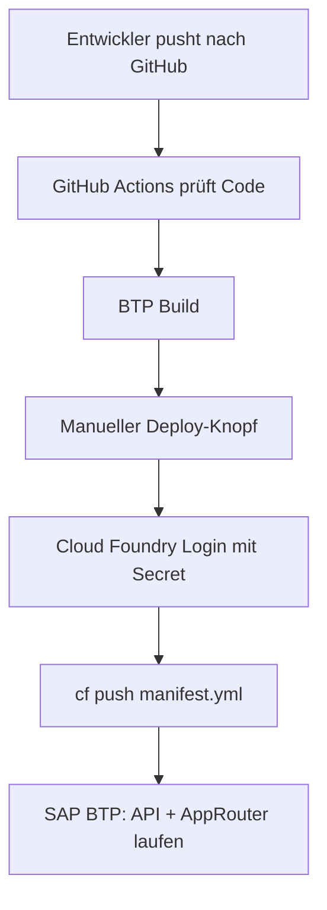

# CI/CD Deployment nach SAP BTP

Diese Pipeline ermöglicht Deployment aus GitHub heraus, ohne jedes Mal einen manuellen SAP-SSO-Code in Codex einzugeben.

## Was die Pipeline macht

- Bei jedem Push nach `main` prüft GitHub Actions den Code.
- Manuelles Deployment läuft über **Actions > SAP BTP CI/CD > Run workflow**.
- Vor dem Deployment werden Checks und BTP-Build ausgeführt.
- Danach werden API und AppRouter mit `manifest.yml` nach SAP BTP Cloud Foundry gepusht.

## Benötigte GitHub-Secrets

In GitHub:

`Repository > Settings > Secrets and variables > Actions > New repository secret`

Pflicht:

```text
CF_API=https://api.cf.us10-001.hana.ondemand.com
CF_ORG=b4bd422ftrial
CF_SPACE=dev
```

Empfohlen für professionelles Deployment:

```text
CF_CLIENT_ID=<technischer Cloud-Foundry-Client>
CF_CLIENT_SECRET=<Secret des technischen Clients>
```

Fallback, wenn noch kein technischer Client existiert:

```text
CF_USERNAME=<BTP Benutzer>
CF_PASSWORD=<BTP Passwort>
```

Der Fallback ist weniger professionell, weil er an einen echten Benutzer gebunden ist. Für ein Unternehmen ist ein technischer Zugang besser.

## Deployment starten

1. GitHub öffnen.
2. Repository `SAP-Autohaus-Hessen` öffnen.
3. Tab **Actions** öffnen.
4. Workflow **SAP BTP CI/CD** auswählen.
5. **Run workflow** anklicken.
6. Warten, bis `Deploy to SAP BTP` grün ist.

## Entwicklungsmodus verwenden

Wenn Anwender während Entwicklung nicht ins System sollen:

```json
"enabled": true
```

in `development-mode.json` setzen, committen und Pipeline laufen lassen.

Nach Abschluss wieder:

```json
"enabled": false
```

setzen und erneut deployen.

## Zielbild


