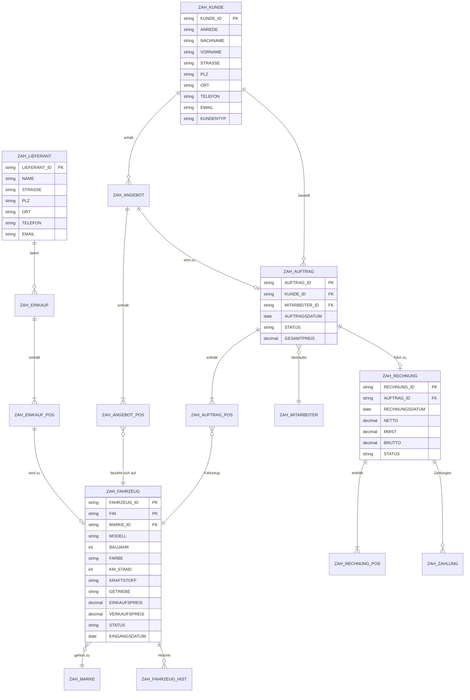

# Datenmodell – Autohaus HESSEN

## ER-Diagramm



## Tabellenübersicht (18 Tabellen)

### Stammdaten

| Tabelle | Beschreibung | Schlüssel |
|---------|--------------|-----------|
| `ZAH_MARKE` | Fahrzeugmarken (VW, BMW, …) | `MARKE_ID` |
| `ZAH_LIEFERANT` | Lieferanten / Hersteller | `LIEFERANT_ID` |
| `ZAH_KUNDE` | Kundenstamm | `KUNDE_ID` |
| `ZAH_MITARBEITER` | Verkäufer / Mitarbeiter | `MITARBEITER_ID` |
| `ZAH_FAHRZEUG` | Fahrzeugstamm (jedes einzelne Auto) | `FAHRZEUG_ID` |

### Einkauf

| Tabelle | Beschreibung | Schlüssel |
|---------|--------------|-----------|
| `ZAH_EINKAUF` | Einkaufsauftrag (Kopf) | `EINKAUF_ID` |
| `ZAH_EINKAUF_POS` | Einkaufsauftrag (Positionen) | `EINKAUF_ID` + `POS_NR` |

### Verkauf

| Tabelle | Beschreibung | Schlüssel |
|---------|--------------|-----------|
| `ZAH_ANGEBOT` | Angebot (Kopf) | `ANGEBOT_ID` |
| `ZAH_ANGEBOT_POS` | Angebot (Positionen) | `ANGEBOT_ID` + `POS_NR` |
| `ZAH_AUFTRAG` | Verkaufsauftrag (Kopf) | `AUFTRAG_ID` |
| `ZAH_AUFTRAG_POS` | Verkaufsauftrag (Positionen) | `AUFTRAG_ID` + `POS_NR` |

### Finanzen

| Tabelle | Beschreibung | Schlüssel |
|---------|--------------|-----------|
| `ZAH_RECHNUNG` | Rechnung (Kopf) | `RECHNUNG_ID` |
| `ZAH_RECHNUNG_POS` | Rechnung (Positionen) | `RECHNUNG_ID` + `POS_NR` |
| `ZAH_ZAHLUNG` | Zahlungseingänge | `ZAHLUNG_ID` |

### Hilfstabellen

| Tabelle | Beschreibung | Schlüssel |
|---------|--------------|-----------|
| `ZAH_FAHRZEUG_HIST` | Status-Historie je Fahrzeug | `FAHRZEUG_ID` + `SEQNR` |
| `ZAH_NUMMERNKREIS` | Automatische Nummernvergabe | `OBJEKT_TYP` |
| `ZAH_KONFIG` | Systemkonfiguration | `PARAM` |

## Nummernkreise

| Objekt | Format | Beispiel |
|--------|--------|----------|
| Kunde | `K` + 6-stellig | `K000001` |
| Fahrzeug | `F` + 8-stellig | `F00000001` |
| Einkauf | `E` + 6-stellig | `E000001` |
| Angebot | `A` + 6-stellig | `A000001` |
| Auftrag | `V` + 6-stellig | `V000001` |
| Rechnung | `R` + 6-stellig | `R000001` |

## Fremdschlüssel-Beziehungen

```
ZAH_FAHRZEUG.MARKE_ID        → ZAH_MARKE.MARKE_ID
ZAH_FAHRZEUG.EINKAUF_ID      → ZAH_EINKAUF.EINKAUF_ID
ZAH_EINKAUF.LIEFERANT_ID     → ZAH_LIEFERANT.LIEFERANT_ID
ZAH_ANGEBOT.KUNDE_ID         → ZAH_KUNDE.KUNDE_ID
ZAH_ANGEBOT_POS.FAHRZEUG_ID  → ZAH_FAHRZEUG.FAHRZEUG_ID
ZAH_AUFTRAG.KUNDE_ID         → ZAH_KUNDE.KUNDE_ID
ZAH_AUFTRAG.MITARBEITER_ID   → ZAH_MITARBEITER.MITARBEITER_ID
ZAH_AUFTRAG.ANGEBOT_ID       → ZAH_ANGEBOT.ANGEBOT_ID
ZAH_AUFTRAG_POS.FAHRZEUG_ID  → ZAH_FAHRZEUG.FAHRZEUG_ID
ZAH_RECHNUNG.AUFTRAG_ID      → ZAH_AUFTRAG.AUFTRAG_ID
ZAH_ZAHLUNG.RECHNUNG_ID      → ZAH_RECHNUNG.RECHNUNG_ID
```
