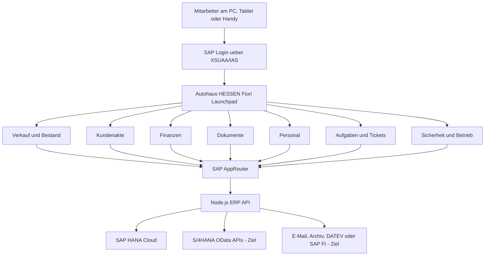
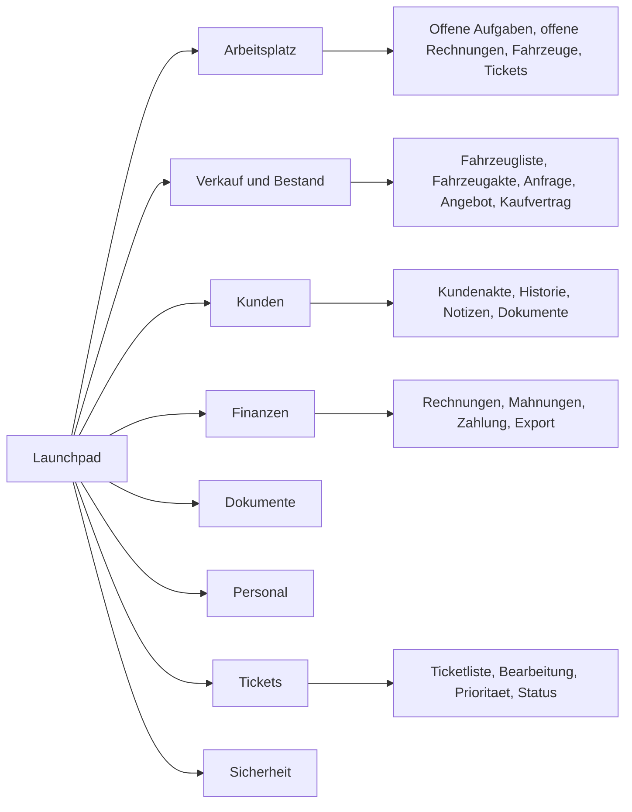
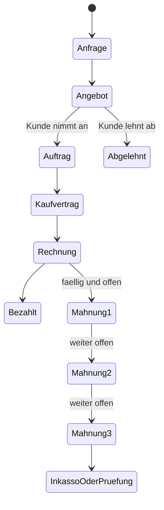
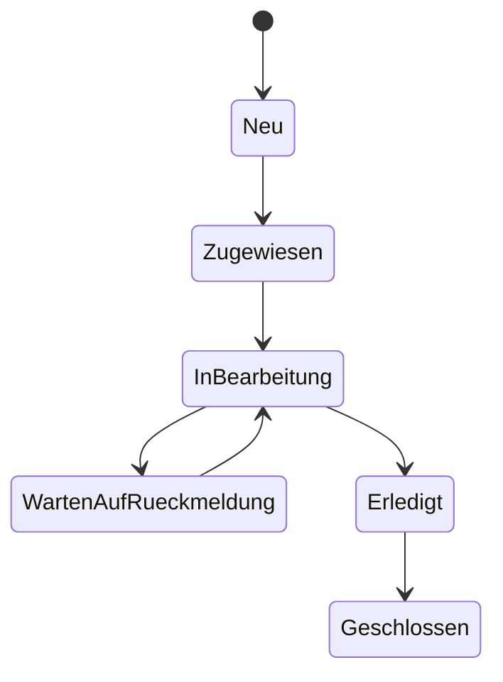
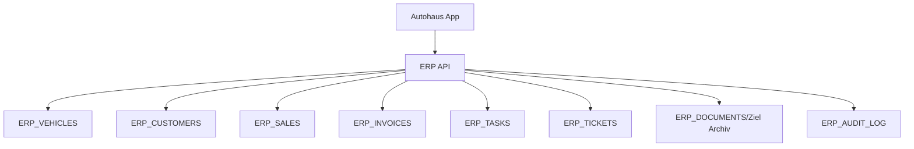

# Autohaus HESSEN ERP - SAP-Fiori- und S/4HANA-Zielkonzept

Stand: 03.08.2026

Dieses Dokument passt die allgemeine SAP-Fiori/S/4HANA-Vorlage konkret auf das Projekt **Autohaus HESSEN ERP** an. Es ist als fachliches und technisches Zielbild gedacht, damit das System Schritt fuer Schritt von der aktuellen BTP-App zu einem professionellen Unternehmenssystem wachsen kann.

Wichtig: Das aktuelle System ist bereits eine eigene SAP-BTP-Anwendung mit Fiori-aehnlichem Launchpad, AppRouter, XSUAA, Node.js-API und SAP HANA Cloud. Ein echtes S/4HANA-System ist noch nicht der Kern des Projekts. S/4HANA wird im Zielbild als spaeterer ERP-Kern angebunden.

## 1. Ausgangssituation

| Punkt | Festlegung fuer Autohaus HESSEN |
| --- | --- |
| App-Name | Autohaus HESSEN ERP Suite |
| Fachbereiche | Verkauf, Fahrzeugbestand, Kunden, Finanzen, Dokumente, Personal, Aufgaben, Tickets, Sicherheit/Betrieb |
| Zielgruppe | Geschaeftsfuehrung, Admin, Verkauf, Finanzen, Personal, Mitarbeiter |
| Sprache | Deutsch, mit korrekten Umlauten |
| Aktuelle SAP-Umgebung | SAP BTP Cloud Foundry, SAP AppRouter, XSUAA, SAP HANA Cloud |
| Zielumgebung | Produktive SAP BTP Umgebung plus spaeter S/4HANA Cloud Private Edition oder SAP S/4HANA Public Cloud |
| Aktuelles Backend | Node.js ERP API |
| Aktuelle Datenbank | SAP HANA Cloud mit ERP-Tabellen |
| Spaeteres SAP-Backend | S/4HANA APIs, OData, CDS/RAP oder freigegebene Standard-APIs |
| App-Ziel | Eine professionelle Autohaus-ERP-Arbeitsplattform, die spaeter SAP-Standardprozesse nutzt |

## 2. Zielbild

Das System soll wie ein modernes SAP-System aufgebaut sein:

## 3. Ist-Aufbau im Projekt

| Schicht | Aktueller Baustein | Bewertung |
| --- | --- | --- |
| Einstieg | `index.html` als Launchpad | Gut fuer eine eigene Fiori-aehnliche Arbeitsoberflaeche |
| Haupt-App | `app.html` mit Modulen | Praktisch, spaeter in einzelne Apps aufteilbar |
| Design | `assets/app.css`, `assets/launchpad.css` | Eigener Enterprise-Stil, weiter ausbaubar |
| Logik | `assets/app.js`, `assets/launchpad.js` | Funktional, spaeter modularisieren |
| Anmeldung | SAP AppRouter + XSUAA | Richtiger SAP-BTP-Weg |
| API | `server/server.js` | Solider eigener API-Kern |
| Datenbank | SAP HANA Cloud | Richtig fuer dauerhafte Unternehmensdaten |
| Deployment | Cloud Foundry + GitHub Actions | Professioneller als manuelles Hochladen |
| Mobile | PWA vorbereitet | Guter erster Schritt zur Handy-App |
| Entwicklungssperre | `development-mode.json` | Professionell fuer Wartung/Release |

## 4. Ziel-App-Typen nach Fiori

Das Projekt ist keine einzelne App, sondern eine **Fiori App Suite**. Jede Abteilung bekommt eine eigene Sicht.

| Bereich | Fiori-App-Typ | Zweck |
| --- | --- | --- |
| Arbeitsplatz | Overview Page | KPIs, offene Arbeit, schnelle Navigation |
| Fahrzeuge | List Report + Object Page | Fahrzeuge suchen, bearbeiten, Fahrzeugakte anzeigen |
| Kunden | List Report + Object Page | Kundenakte mit Angeboten, Rechnungen, Dokumenten |
| Verkauf | Worklist + Wizard | Anfrage, Angebot, Auftrag und Kaufvertrag fuehren |
| Finanzen | Analytical List Page | Rechnungen, offene Posten, Mahnungen, Zahlungseingang |
| Dokumente | Object Page + Dokumentenliste | PDF, Versionen, Download, Druck, E-Mail |
| Personal | List Report + Object Page | Mitarbeiter, Abteilung, Lohnabrechnung als Muster |
| Aufgaben/Tickets | Worklist/Kanban | Arbeit verteilen, Status verfolgen |
| Sicherheit | Admin Object Page | Rollen, Audit, Betrieb, Export, Monitoring |

## 5. Launchpad und Navigation

Das Launchpad soll fuer Anwender einfach bleiben. Der Benutzer sieht nur die Apps, die zu seiner Rolle passen.

### Navigationsregeln

1. Chef/Admin sieht alle Kacheln.
2. Verkauf sieht Verkauf, Bestand, Kunden, Dokumente und Tickets.
3. Finanzen sieht Finanzen, Kunden, Dokumente und Mahnungen.
4. Personal sieht Personal, Dokumente und interne Tickets.
5. Mitarbeiter sieht Arbeitsplatz, eigene Aufgaben und eigene Tickets.
6. Rollenzuordnung erfolgt nicht mehr im Frontend, sondern ueber SAP BTP Role Collections.

## 6. Zentrale Geschaeftsobjekte

### Fahrzeugakte

| Feld | Bedeutung | Pflicht | Quelle |
| --- | --- | --- | --- |
| Fahrzeug-ID | Interne Nummer | Ja | HANA/API |
| FIN | Fahrzeugidentnummer | Ja | HANA, spaeter S/4HANA Material/Equipment |
| Marke | Hersteller | Ja | HANA |
| Modell | Modellbezeichnung | Ja | HANA |
| Erstzulassung | Zulassungsdatum | Nein | HANA |
| Kilometerstand | Aktueller Kilometerstand | Ja | HANA |
| Einkaufspreis | Interner Einkauf | Ja fuer Chef/Finanzen | HANA |
| Verkaufspreis | Verkaufspreis | Ja | HANA |
| Marge | Automatisch berechnet | Ja | API |
| Status | Verfuegbar, Reserviert, Verkauft, In Werkstatt | Ja | API |
| TUEV/AU | Gueltigkeit | Nein | HANA |
| Dokumente | Vertrag, Bilder, Nachweise | Nein | Archiv |

### Kundenakte

| Feld | Bedeutung | Pflicht | Quelle |
| --- | --- | --- | --- |
| Kunden-ID | Interne Kundennummer | Ja | HANA/API |
| Kundentyp | Privat, Firma, Haendler | Ja | HANA |
| Name/Firma | Kunde oder Unternehmen | Ja | HANA |
| Adresse | Rechnungsadresse | Ja fuer Rechnung | HANA |
| E-Mail | E-Mail-Versand | Nein, fuer Versand Ja | HANA |
| Telefon | Rueckruf | Nein | HANA |
| DSGVO-Einwilligung | Datenschutzstatus | Ja fuer Marketing | HANA |
| Historie | Anfragen, Angebote, Rechnungen | Automatisch | API |

### Anfrage, Angebot, Auftrag

| Feld | Bedeutung | Pflicht | Quelle |
| --- | --- | --- | --- |
| Vorgangsnummer | Anfrage/Angebot/Auftrag | Ja | Nummernkreis |
| Kunde | Bezug zur Kundenakte | Ja | HANA/API |
| Fahrzeug | Bezug zur Fahrzeugakte | Ja bei Fahrzeugverkauf | HANA/API |
| Status | Neu, In Bearbeitung, Angebot erstellt, Angenommen, Abgelehnt | Ja | API |
| Preis | Angebotspreis | Ja | API |
| Gueltig bis | Angebotsfrist | Ja | API |
| Verkaeufer | Bearbeiter | Ja | SAP Login/BTP |
| Dokument | Angebot oder Kaufvertrag als PDF | Ja bei Ausgabe | Archiv |

### Rechnung und Mahnung

| Feld | Bedeutung | Pflicht | Quelle |
| --- | --- | --- | --- |
| Rechnungsnummer | Eindeutige Nummer | Ja | Nummernkreis |
| Rechnungsdatum | Belegdatum | Ja | API |
| Kunde | Rechnungsempfaenger | Ja | Kundenakte |
| Positionen | Leistungen/Fahrzeuge | Ja | API |
| Netto | Betrag ohne USt. | Ja | API |
| Umsatzsteuer | 19 Prozent oder Sonderfall | Ja | API/FI |
| Brutto | Endbetrag | Ja | API |
| Faelligkeit | Zahlungsfrist | Ja | API |
| Zahlungsstatus | Offen, Teilbezahlt, Bezahlt, Ueberfaellig | Ja | API |
| Mahnstufe | Keine, 1, 2, 3 | Ja bei Verzug | API |
| Versandstatus | Entwurf, Gesendet, Gedruckt, Archiviert | Ja | API/Archiv |

### Aufgaben und Tickets

Aufgaben und Tickets duerfen sich nicht doppeln. Die professionelle Struktur ist:

| Objekt | Zweck |
| --- | --- |
| Aufgabe | Konkrete Arbeit fuer eine Person, zum Beispiel Rueckruf, Probefahrt vorbereiten, Rechnung pruefen |
| Ticket | Vorgang mit Problem, Anfrage oder interner Klärung, zum Beispiel IT-Problem, Kundenbeschwerde, Freigabebedarf |

Regel: Ein Ticket kann mehrere Aufgaben erzeugen. Eine Aufgabe muss nicht immer ein Ticket haben.

## 7. Such- und Filterkonzept

Jede Liste soll kurze, schnelle Filter haben:

| App | Suchfelder | Filter |
| --- | --- | --- |
| Fahrzeuge | FIN, Marke, Modell, Kennzeichen | Status, Preisbereich, TUEV, Standort |
| Kunden | Name, Firma, E-Mail, Telefon | Kundentyp, Ort, offene Vorgänge |
| Verkauf | Vorgangsnummer, Kunde, Fahrzeug | Status, Verkaeufer, Datum |
| Finanzen | Rechnungsnummer, Kunde | Offen, ueberfaellig, Mahnstufe, Monat |
| Dokumente | Dokumentnummer, Kunde, Fahrzeug | Typ, Status, Ersteller, Datum |
| Personal | Name, Abteilung, Rolle | Aktiv, Abteilung, Vertragsart |
| Tickets | Ticketnummer, Titel, Kunde | Prioritaet, Status, Abteilung, Faelligkeit |

## 8. Aktionen und Buttons

Alle Aktionen sollen fachlich klar und gleich aufgebaut sein.

| Bereich | Primaere Aktionen |
| --- | --- |
| Fahrzeuge | Fahrzeug anlegen, bearbeiten, Kaufvertrag drucken, Status aendern |
| Kunden | Kunde anlegen, Kundenakte öffnen, Notiz erfassen, Dokument senden |
| Verkauf | Anfrage erstellen, Angebot erzeugen, Angebot per E-Mail senden, Auftrag erstellen |
| Finanzen | Rechnung erstellen, Zahlung buchen, Mahnung 1/2/3 erzeugen, PDF drucken, per E-Mail senden |
| Dokumente | PDF anzeigen, herunterladen, drucken, per E-Mail senden, Version archivieren |
| Personal | Mitarbeiter anlegen, Lohnabrechnung monatlich erzeugen, Dokument drucken |
| Tickets | Ticket erstellen, zuweisen, Status aendern, Aufgabe erzeugen |
| Sicherheit | Betriebsbericht exportieren, Audit ansehen, Entwicklungsmodus pruefen |

## 9. Fachliche Regeln

### Fahrzeuge

1. Ein verkauftes Fahrzeug darf nicht erneut verkauft werden.
2. Ein reserviertes Fahrzeug braucht einen Kundenbezug.
3. Marge = Verkaufspreis minus Einkaufspreis minus Kosten.
4. Einkaufspreis und Marge sind nur fuer Chef, Admin und Finanzen sichtbar.
5. Kaufvertrag kann nur gedruckt werden, wenn Kunde und Fahrzeug vollstaendig sind.

### Verkauf

1. Aus einer Anfrage kann ein Angebot entstehen.
2. Aus einem angenommenen Angebot kann ein Auftrag entstehen.
3. Bei Auftrag wird das Fahrzeug reserviert oder verkauft.
4. Jede Ausgabe eines Angebots wird als Dokument protokolliert.
5. Stornierung braucht Grund und Audit-Eintrag.

### Finanzen

1. Rechnungen bekommen eindeutige Nummern.
2. Offene Rechnungen werden nach Faelligkeit markiert.
3. Mahnstufe 1, 2 und 3 bekommen eigene Vorlagen.
4. Versand per E-Mail wird protokolliert.
5. Offizielle Buchhaltung muss spaeter ueber S/4HANA FI oder DATEV freigegeben werden.

### Personal

1. Lohnabrechnung im aktuellen System ist ein Muster.
2. Echte Lohnsteuer, Sozialversicherung, ELStAM, DEUEV und Krankenkassenmeldungen muessen ueber zertifizierte Systeme laufen.
3. Personaldaten sind besonders schutzbeduerftig und nur fuer HR/Chef sichtbar.

## 10. Meldungen und Fehler

| Situation | Meldung |
| --- | --- |
| Speichern erfolgreich | Der Vorgang wurde gespeichert. |
| Pflichtfeld fehlt | Bitte fuellen Sie alle Pflichtfelder aus. |
| Keine Berechtigung | Sie haben fuer diesen Bereich keine Berechtigung. |
| Fahrzeug verkauft | Dieses Fahrzeug ist bereits verkauft. |
| Rechnung ohne Kunde | Fuer eine Rechnung muss ein Kunde ausgewaehlt sein. |
| E-Mail fehlt | Fuer den Versand ist eine E-Mail-Adresse erforderlich. |
| HANA nicht erreichbar | Die Datenbank ist aktuell nicht erreichbar. Bitte spaeter erneut versuchen. |
| Entwicklungsmodus aktiv | Das System wird aktuell gewartet. Bitte spaeter erneut anmelden. |

## 11. Rollenmodell

Die Rollen sollen in SAP BTP als Role Collections vergeben werden. Die App darf keine sichtbare Rollenauswahl fuer Anwender haben.

| Rolle | Zugriff |
| --- | --- |
| `Autohaus_Admin` | Alles, inklusive Sicherheit, Betrieb, Rollenpruefung |
| `Autohaus_Chef` | Dashboard, Finanzen, Marge, Verkauf, Personal, Audit |
| `Autohaus_Verkauf` | Fahrzeuge, Kunden, Verkauf, Dokumente, eigene Aufgaben |
| `Autohaus_Finanzen` | Rechnungen, Mahnungen, Zahlungen, Kunden, Dokumente |
| `Autohaus_HR` | Personal, Lohnmuster, Personaldokumente |
| `Autohaus_Mitarbeiter` | Arbeitsplatz, eigene Aufgaben, eigene Tickets |
| `Autohaus_Service` | Tickets, Aufgaben, Fahrzeugstatus, Termine |

Spaeter in S/4HANA muessen die BTP-Rollen mit SAP-Berechtigungen abgestimmt werden. Das macht normalerweise der SAP-Security-Berater zusammen mit dem Unternehmen.

## 12. Workflow- und Statusmodell

### Verkaufsprozess

### Ticketprozess

## 13. Technisches Zielkonzept

### Kurzfristig, aktuelles Projekt

| Thema | Umsetzung |
| --- | --- |
| Frontend | Bestehende Launchpad- und App-Oberflaeche weiter ausbauen |
| API | Node.js API als zentrale Schicht behalten |
| Daten | SAP HANA Cloud Tabellen `ERP_*` nutzen |
| Login | AppRouter + XSUAA |
| Rollen | BTP Role Collections auslesen und UI/API absichern |
| Dokumente | PDF erzeugen, Version, Ersteller, Zeit und Versand protokollieren |
| E-Mail | Technischen E-Mail-Dienst anbinden |
| Betrieb | Betriebsbericht, Monitoring, Entwicklungsmodus, Audit |

### Mittelfristig, professionelle SAP-BTP-Erweiterung

| Thema | Umsetzung |
| --- | --- |
| API-Standard | CAP/OData oder sauber strukturierte REST/OData-Schicht |
| Datenmodell | Relationale Tabellen fuer Kunden, Fahrzeuge, Belege, Dokumente |
| Rollen | Rollen in BTP + API-Pruefung auf jeder geschuetzten Aktion |
| CI/CD | GitHub Actions oder SAP Deployment Pipeline |
| Tests | Build-Test, API-Test, Rollen-Test, Smoke-Test nach Deployment |
| Monitoring | BTP Logs, Health Endpoint, technische Alarme |
| Archiv | Dokumentenservice oder externes revisionssicheres Archiv |

### Langfristig, S/4HANA Integration

| Fachbereich | Zielsystem |
| --- | --- |
| Kundenstamm | S/4HANA Business Partner |
| Verkauf | S/4HANA SD, Sales Order/Billing, falls passend |
| Einkauf/Bestand | S/4HANA MM oder eigenes Fahrzeugbestandsmodell |
| Buchhaltung | S/4HANA FI/CO oder DATEV-Schnittstelle |
| Erweiterungen | ABAP RAP, CDS Views, OData |
| App-Zugriff | BTP Destination zu S/4HANA APIs |

API-Kandidaten muessen im echten S/4HANA-System geprueft werden, zum Beispiel Business Partner, Sales Order, Billing Document, Journal Entry und Attachment APIs. Nicht jede API ist in jeder Edition und Lizenz gleich verfuegbar.

## 14. Datenhaltung

Aktuell speichert das Projekt seine eigenen Autohaus-Daten in SAP HANA Cloud. Das ist fuer eine eigene BTP-App der richtige Weg.

Fuer ein produktives Unternehmen muessen spaeter entschieden werden:

1. Welche Daten bleiben in HANA als eigene Autohaus-Daten?
2. Welche Daten gehoeren in S/4HANA?
3. Welche Dokumente muessen revisionssicher archiviert werden?
4. Welche Daten duerfen nach DSGVO geloescht oder anonymisiert werden?
5. Wie werden Backups, Wiederherstellung und Zugriffsprotokolle geregelt?

## 15. KI-Unterstuetzung

KI darf helfen, aber wichtige Geschaeftsentscheidungen muessen vom Menschen freigegeben werden.

| Funktion | KI-Unterstuetzung | Menschliche Freigabe |
| --- | --- | --- |
| Angebotstext | Formulierungsvorschlag | Verkaeufer |
| Mahnung | Professioneller Textvorschlag | Finanzen |
| Kundennotiz | Zusammenfassung | Bearbeiter |
| Ticket | Prioritaet und Kategorie vorschlagen | Teamleiter |
| Fahrzeugbeschreibung | Verkaufstext generieren | Verkaeufer |
| Betriebsbericht | Risiken zusammenfassen | Admin/Chef |

## 16. Umsetzung in Entwicklungsstufen

### Stufe 1: Aktuelle App produktiver machen

1. Rollen aus BTP konsequent in App und API pruefen.
2. Dashboard-KPIs nur aus echten API/HANA-Daten berechnen.
3. Rechnungen, Angebote, Mahnungen und Kaufvertraege als PDF vereinheitlichen.
4. E-Mail-Senden und Drucken an allen Dokumentenstellen einbauen.
5. Audit-Log bei kritischen Aktionen schreiben.
6. Fehlerseiten fuer Login, API, Datenbank und Wartung verbessern.

### Stufe 2: Datenmodell professionalisieren

1. JSON-Struktur weiter in relationale Tabellen aufteilen.
2. Nummernkreise transaktionssicher machen.
3. Dokumentenarchiv mit Versionen erstellen.
4. Zahlungsstatus, Mahnstufen und Export fuer Steuerberater ergaenzen.
5. Kundenakte und Fahrzeugakte als zentrale Object Pages ausbauen.

### Stufe 3: SAP-Integration

1. S/4HANA Zielsystem auswaehlen: Public oder Private.
2. BTP Destination einrichten.
3. Freigegebene S/4HANA APIs pruefen.
4. Kunden, Rechnungen oder Buchungen testweise synchronisieren.
5. Berechtigungen und Rollen zwischen BTP und S/4HANA abstimmen.

### Stufe 4: Produktiver Betrieb

1. Trial durch produktive BTP-Umgebung ersetzen.
2. Backup- und Restore-Prozess dokumentieren.
3. Monitoring mit Alarmierung aktivieren.
4. DSGVO-Konzept pruefen lassen.
5. Freigabeprozess fuer Releases einfuehren.
6. Schulungsunterlagen fuer Anwender erstellen.

## 17. Abnahmekriterien

Das System ist fuer den echten Unternehmenseinsatz erst bereit, wenn diese Punkte erfuellt sind:

| Bereich | Kriterium |
| --- | --- |
| Anmeldung | Benutzer melden sich ueber SAP/BTP an |
| Rollen | Jeder Benutzer sieht nur seine Abteilung |
| Daten | Daten werden dauerhaft in HANA oder S/4HANA gespeichert |
| Dokumente | PDF wird gespeichert, versioniert, gedruckt und per E-Mail gesendet |
| Finanzen | Rechnungen, Mahnungen und Zahlungseingaenge sind nachvollziehbar |
| Audit | Kritische Aktionen werden protokolliert |
| Backup | Wiederherstellung wurde getestet |
| Mobile | PWA funktioniert auf Handy und Tablet |
| Sicherheit | Session, Abmeldung, Fehlerseiten und Zugriffsschutz sind sauber |
| Recht | Steuer, Lohn, Datenschutz und Archivierung sind fachlich freigegeben |

## 18. Konkreter naechster Sprint

Empfohlene Reihenfolge fuer die naechste Entwicklung:

1. Dashboard-Kacheln so anbinden, dass keine Striche mehr erscheinen, sondern echte Werte oder klare Leerzustaende.
2. Rollen aus XSUAA/BTP serverseitig auswerten.
3. Mahnstufe 1, 2 und 3 mit PDF, Druck und E-Mail vorbereiten.
4. Dokumentenaktionen vereinheitlichen: Anzeigen, Drucken, E-Mail, Archiv.
5. Kundenakte und Fahrzeugakte als Object Page verbessern.
6. HANA-Leseansicht im Admin/Sicherheitsbereich ergaenzen.
7. Login-Fehler fuer Handy/Token-Time-out besser erklaeren.
8. Smoke-Test nach GitHub-Deployment automatisieren.

## 19. Angepasster Auftrag fuer Entwickler oder SAP-Partner

Der folgende Text kann als klare Aufgabenbeschreibung verwendet werden:

> Konzipiere und entwickle die Autohaus HESSEN ERP Suite als professionelle SAP-BTP-Fiori-Anwendung fuer ein deutsches Autohaus. Die aktuelle Anwendung laeuft auf SAP BTP Cloud Foundry mit AppRouter, XSUAA, Node.js API und SAP HANA Cloud. Ziel ist eine Fiori-aehnliche App Suite mit Launchpad, Rollen nach BTP Role Collections, Abteilungs-Apps fuer Verkauf, Bestand, Kunden, Finanzen, Dokumente, Personal, Aufgaben/Tickets und Sicherheit/Betrieb. Die Anwendung soll spaeter mit S/4HANA Cloud Private Edition oder S/4HANA Public Cloud ueber freigegebene OData APIs und BTP Destinations verbunden werden. Finanzprozesse sollen spaeter ueber SAP FI/CO, DATEV oder ein freigegebenes Buchhaltungssystem erfolgen. Lohnabrechnung in der App bleibt bis zur Anbindung eines zertifizierten Lohnsystems ein Muster. Alle Oberflaechen muessen deutsch, rollenbasiert, responsiv, auditierbar und fuer produktiven Betrieb vorbereitet sein.

## 20. Klare Bewertung

Das Projekt ist fuer einen selbst entwickelten SAP-BTP-Prototypen gut aufgebaut, weil es bereits diese professionellen Elemente hat:

1. SAP BTP Deployment.
2. AppRouter und XSUAA.
3. SAP HANA Cloud als dauerhafte Datenbank.
4. Eigene API statt reiner Browser-Speicherung.
5. Fiori-aehnliches Launchpad.
6. PWA-Grundlage fuer Handy.
7. Audit, Betriebsbericht und Entwicklungsmodus.
8. GitHub Actions fuer CI/CD.

Fuer ein echtes produktives ERP fehlen noch vor allem:

1. Produktive SAP-BTP-Lizenz statt Trial/Free-Tier.
2. Konsequente serverseitige Rollenpruefung.
3. Revisionssicheres Dokumentenarchiv.
4. Rechtlich freigegebene Buchhaltung und Lohnprozesse.
5. Monitoring, Backup-Test und Restore-Test.
6. S/4HANA- oder DATEV-Integration.
7. Mehr automatische Tests.

Damit ist der richtige Weg klar: Die aktuelle App bleibt der Autohaus-Arbeitsplatz. S/4HANA wird spaeter der offizielle ERP-Kern fuer Standardprozesse.
