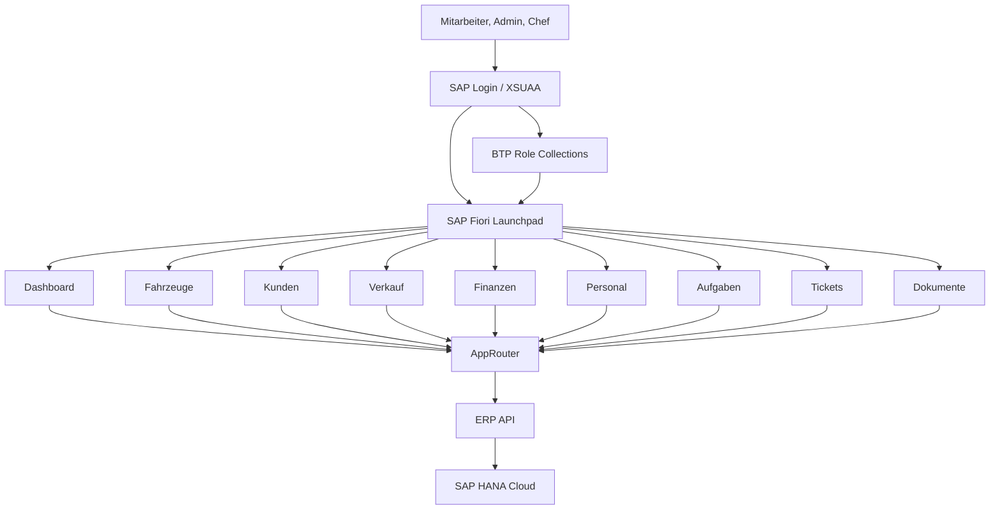
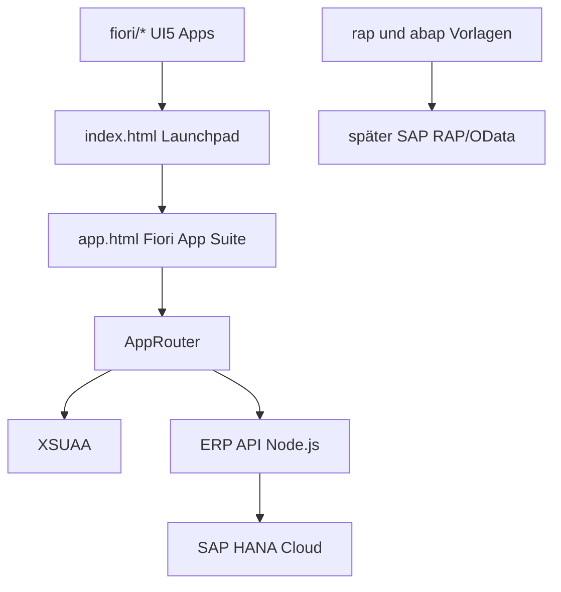

# SAP Fiori Zielarchitektur

## Zielbild

Autohaus HESSEN soll wie ein SAP-System aufgebaut sein: Benutzer melden sich über SAP/BTP an, sehen ein Fiori Launchpad und öffnen dort nur die Apps, für die sie berechtigt sind.

## Aktueller Projektaufbau

## Nächste technische Ausbaustufen

1. Die vorbereiteten UI5 Apps unter `fiori/*` einzeln produktionsreif machen.
2. Jede App direkt an `/api` oder später an OData anbinden.
3. BTP Role Collections erstellen und Benutzern zuweisen.
4. Die App Suite schrittweise in echte getrennte Fiori Apps aufteilen.
5. Später CAP/OData oder SAP RAP als offizielles Backend ergänzen.
