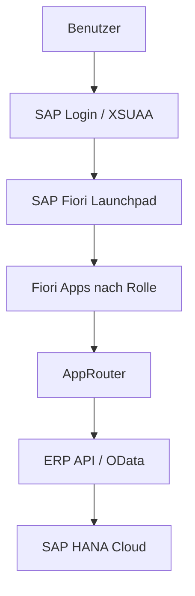

# Autohaus HESSEN Fiori Launchpad Rollen

## Ziel

Alle Mitarbeiter starten später im SAP Fiori Launchpad. Die Kacheln werden über BTP Role Collections gesteuert. Die App selbst wertet die Rollen zusätzlich aus, damit Bereiche auch technisch geschützt bleiben.

## Semantic Objects

| Semantic Object | Action | App | Bereich |
|---|---|---|---|
| `ZAHDashboard` | `display` | Dashboard | Management |
| `ZAHFahrzeug` | `display` | Fahrzeuge | Bestand |
| `ZAHKunde` | `display` | Kunden | CRM |
| `ZAHVerkauf` | `display` | Verkauf | Verkauf |
| `ZAHFinanzen` | `display` | Finanzen | Rechnungswesen |
| `ZAHDokumente` | `display` | Dokumente | Archiv |
| `ZAHPersonal` | `display` | Personal | HR |
| `ZAHAufgaben` | `display` | Aufgaben | Termine |
| `ZAHTickets` | `display` | Tickets | Workflow |
| `ZAHBriefe` | `display` | Briefe | Korrespondenz |

## BTP Role Collections

| Role Collection | Zugriff |
|---|---|
| `AH_Admin` | Alle Apps, Stammdaten, Sicherheit, Export |
| `AH_Chef` | Dashboard, Verkauf, Finanzen, Fahrzeuge, Kunden, Dokumente |
| `AH_Verkauf` | Dashboard, Fahrzeuge, Kunden, Verkauf, Briefe, Aufgaben, Tickets |
| `AH_Finanzen` | Dashboard, Kunden, Finanzen, Dokumente, Aufgaben, Tickets |
| `AH_Personal` | Dashboard, Personal, Aufgaben, Tickets |
| `AH_Mitarbeiter` | Dashboard, eigene Aufgaben, Tickets, freigegebene Bereiche |

## SAP Zielaufbau

## Umsetzung im Projekt

- `index.html` ist der sichtbare Launchpad-Einstieg.
- `app.html` ist die aktuelle Fiori App Suite mit allen Fachbereichen.
- `fiori/*` enthält vorbereitete einzelne UI5/Fiori Apps.
- `server/server.js` ist der ERP-Kern mit SAP-HANA-Anbindung.
- `xs-security.json` definiert die technischen Rollen/Scopes.
